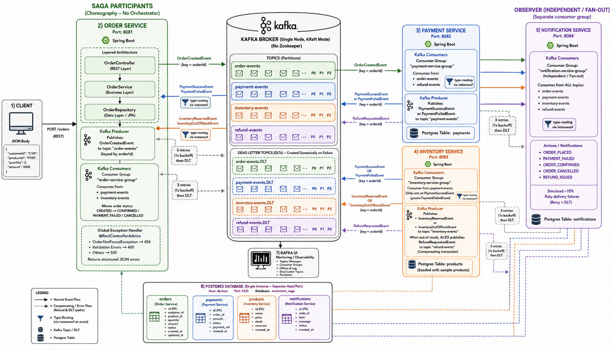

# Kafka E-Commerce Saga

Order → Payment → Inventory choreography saga, plus a Notification service that
fans out on every event, built with Spring Boot + Spring Kafka to learn core
Kafka concepts through a working, testable project.

## Prerequisites

- **Java 17** — check with `java -version`. If your machine's default `JAVA_HOME`
  points at an older JDK (common on Windows installs with multiple JDKs), point
  Maven at 17 explicitly for every command below, e.g.:
  ```bash
  # PowerShell
  $env:JAVA_HOME = "C:\Program Files\Java\jdk-17"
  ```
- **Docker Desktop** (for Kafka, Kafka UI, Postgres)
- **Maven** (`mvn -v`)

## Architecture



Each service follows a layered structure: `Controller → Service → Repository`,
with business logic living in `@Service` classes (never called directly from
controllers). REST errors are handled centrally via a `@RestControllerAdvice`
(`GlobalExceptionHandler`) that returns structured JSON instead of Spring's
default whitelabel error page — see `order-service`'s `exception` package for
the fullest example (custom `OrderNotFoundException`, bean validation on
`CreateOrderRequest`, field-level validation error messages).

## Services

| Service               | Port | Consumes                                                       | Produces                        |
|------------------------|------|-----------------------------------------------------------------|-----------------------------------|
| order-service          | 8081 | payment-events, inventory-events                                 | order-events                      |
| payment-service        | 8082 | order-events, refund-events                                      | payment-events                    |
| inventory-service      | 8083 | payment-events                                                   | inventory-events, refund-events   |
| notification-service   | 8084 | order-events, payment-events, inventory-events, refund-events    | (none, just logs/persists)        |

Seeded products (see `inventory-service/src/main/resources/data.sql`):
`P100` (Wireless Mouse, stock 50), `P101` (Mechanical Keyboard, stock 20),
`P102` (USB-C Hub, stock 2 — order more than 2 to trigger the out-of-stock /
refund / cancellation path).

## Run it

1. Start infra:

   ```bash
   docker compose up -d
   ```

   This brings up Kafka (`localhost:29092` from the host), Kafka UI
   (http://localhost:8090) and Postgres (`localhost:5435`, db `kafkadb`,
   user/pass `kafka`/`kafka`). Port 5435 (not the default 5432) is used to
   avoid clashing with a native PostgreSQL install running on the host — see
   Troubleshooting below if you still hit a port conflict.

2. Build everything:

   ```bash
   mvn clean install
   ```

3. Run each service in its own terminal (or via your IDE):

   ```bash
   mvn -pl order-service spring-boot:run
   mvn -pl payment-service spring-boot:run
   mvn -pl inventory-service spring-boot:run
   mvn -pl notification-service spring-boot:run
   ```

4. Place an order:

   ```bash
   curl -X POST http://localhost:8081/orders \
     -H "Content-Type: application/json" \
     -d '{"customerId":"C1","productId":"P100","quantity":1,"amount":49.99}'
   ```

5. Watch it flow:
   - `GET http://localhost:8081/orders/{orderId}` — status moves CREATED → CONFIRMED (or PAYMENT_FAILED / CANCELLED)
   - `GET http://localhost:8084/notifications` — one row per event the customer would be told about
   - http://localhost:8090 (Kafka UI) — inspect topics, partitions, consumer group offsets, and any `.DLT` topics live
   - pgAdmin (optional) — register a new server pointing at `localhost:5435`, db `kafkadb`, user/pass `kafka`/`kafka` to browse the `orders`/`payments`/`products`/`notifications` tables directly

### Resetting for a clean test run

Kafka UI's message counts are cumulative for a topic's entire history, not just
your latest order — if you've been testing for a while, old messages pile up
and make results confusing. To start clean:

- Kafka UI → Topics → select all → **"Purge messages of selected topics"**
- In Postgres: `TRUNCATE TABLE orders, payments, products, notifications RESTART IDENTITY CASCADE;`
  (this also clears the seeded products — restart `inventory-service` afterward
  to re-seed, since `data.sql` only runs once per schema creation)

## What to look at for each Kafka concept

- **Producers/consumers, `@KafkaListener`**: every `*Producer`/`*Listener` class
- **Partitioning/ordering**: events are keyed by `orderId` (see `OrderProducer`) so all events for one order land on the same partition
- **Consumer groups & fan-out**: order/payment/inventory services each use their own group and only care about specific topics; notification-service uses a separate group and reads all four topics independently
- **Saga / compensating transactions**: `InventoryEventListener` publishes a `RefundRequestedEvent` when stock runs out after payment already succeeded; `PaymentEventListener.onRefundRequested` reverses it
- **Retry + Dead Letter Topic**: each service's `KafkaConsumerConfig` retries a failing listener 3x then republishes to `<topic>.DLT`; `NotificationSender` randomly fails ~15% of the time so you can watch this happen in `notification-service` logs and in Kafka UI (`*.DLT` topics)

## Troubleshooting

- **`password authentication failed for user "kafka"`** — a native PostgreSQL
  install on your machine is likely already listening on port 5432, so your
  app connects to that instead of the Docker container. This project maps the
  container to host port `5435` specifically to avoid this; if you changed it
  back to `5432`, check `Get-Service -Name "*postgres*"` (Windows) for a
  conflicting local service first.
- **Producer silently "succeeds" but nothing shows up downstream** —
  `KafkaTemplate.send()` returns a `CompletableFuture` that fails silently if
  you never inspect it. `OrderProducer` attaches a `.whenComplete(...)`
  callback specifically so failures actually get logged instead of vanishing.
- **A listener's `instanceof SomeEvent` check is always `false`, even though
  the JSON was deserialized correctly** — this is a real Spring Kafka gotcha:
  a `@KafkaListener` method with a plain `Object` parameter can get bound to
  the raw `ConsumerRecord` itself instead of the deserialized payload (even
  with `@Payload` added). Every listener in this project that handles multiple
  event types on one topic sidesteps this by declaring the parameter as
  `ConsumerRecord<String, Object>` explicitly and calling `.value()` — see any
  method in `*EventListener`/`NotificationListener` for the pattern.
- **`Node -1 disconnected` spamming the logs every ~9-10 minutes** — this is
  normal; it's just the Kafka client reconnecting after its idle broker
  connection was closed (`connections.max.idle.ms`). Not an error.
